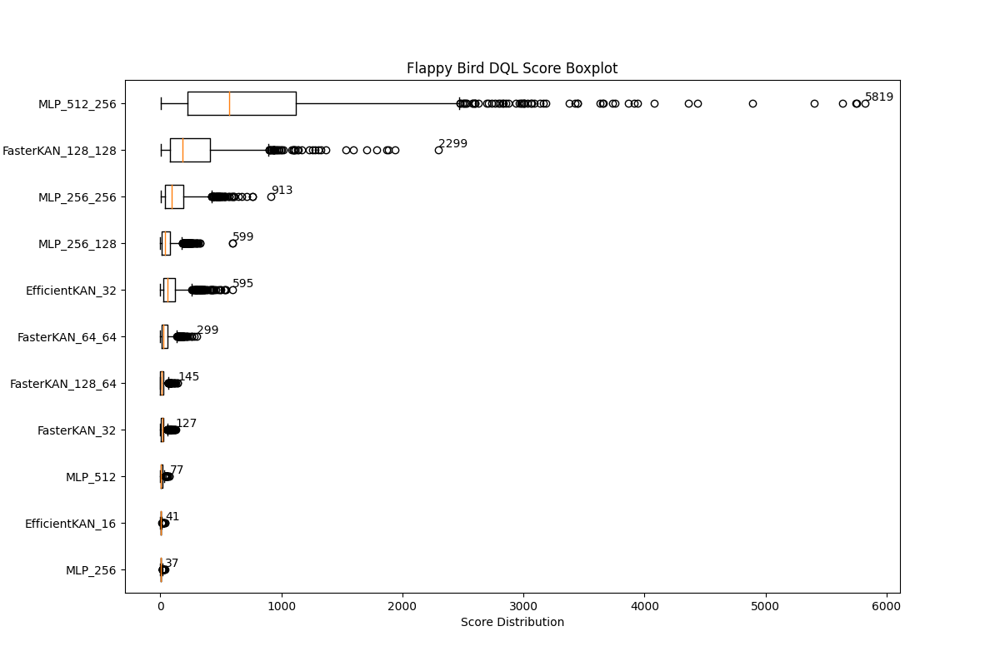

# KAN It Play Flappy Bird?
Credits: Dinh Ngoc An
The reposiory is under construction. Please check back later for the finished version.

## Introduction
This is a simple project to test the capabilities of the [KAN](https://arxiv.org/abs/2404.19756) (Kolmogorov-Arnold Networks) model on a simple Flappy Bird game using Reinforcement Learning. Here, the RL algorithm used is Deep Q-Network (DQN) with the original Linear layer replaced with KAN model. For efficiency comparison, the original MLP model is also implemented for comparison, and an efficient implementation of KAN - [FasterKAN](https://github.com/AthanasiosDelis/faster-kan) will be used.

## Installation
1. Clone the repository

Clone the repository using the following command:
```bash
git clone https://github.com/andythetechnerd03/KAN-It-Play-Flappy-Bird.git
```

2. Install the required packages

We recommend using a virtual environment to install the required packages and avoid dependencies issue (trust me, it's frustrating). You can create a virtual environment using the following command:
```bash
python -m venv venv
```
Then, activate the virtual environment:
```bash
source venv/bin/activate
```
Now, install the required packages using the following command:
```bash
pip install -r requirements.txt
```

**Note**: In the `src/kan` folder you will find the implementation of the EfficientKAN (`kan.py`) and the FasterKAN (`fasterkan_*.py`) models. You may have to update these files using the latest implementation from the [FasterKAN](https://github.com/AthanasiosDelis/faster-kan) repository and [EfficientKAN](https://github.com/Blealtan/efficient-kan/tree/master).

## Usage
To train the model, simply run the following command:
```bash
python main.py --env env_name --train --device cpu --render --num_episodes num_episodes
```
- You can remove the `--train` flag to test the model without training it.
- `env_name` is the name of the environment you want to use (hint: it should be the first header of `config.yaml` file).
- `device` is the device you want to use for training (cpu or cuda).
- `render` flag is used to render the game on a PyGame interface while testing only.
- `num_episodes` is the number of episodes you want to test the model, defaults to 1.

## Hyperparameters tuning
You can tune the hyperparameters in the `config.yaml` file. Here are some important hyperparameters that you might want to tune:
```yaml
name_of_train_instance:
    env_id: Environment ID (flappy_bird)
    experience_replay_size: Size of the experience replay buffer
    batch_size: Batch size
    epsilon_start: Initial epsilon value
    epsilon_end: Final epsilon value
    epsilon_decay: Epsilon decay rate after each episode
    network_update_frequency: Frequency of updating the target network
    learning_rate: Learning rate
    discount_factor: Discount factor (default: 0.99)
    stop_on_reward: Stop training when the average reward reaches this value
    model_params:
        model_type: Either 'kan' or 'mlp' for experiment
        num_hidden_units: Number of hidden units in either of those model types (note that we only have one hidden layer).
    env_params:
        use_lidar: Whether to use lidar as input to the model (default: False)
```

## Experiment results and Analysis
The following results are generated using the following hyperparameters:
| Hyperparameter | Value |
|----------------|-------|
| Experience Replay Size | 10000 |
| Batch Size | 32 |
| Epsilon Start | 1.0 |
| Epsilon End | 0.01 |
| Epsilon Decay | 0.99995 |
| Network Update Frequency | 1000 |
| Learning Rate | 0.0001 |
| Discount Factor | 0.99 |
| Stop on Reward | 100000 |
| Number of States/Actions | 12 and 2 |
| Max Episodes | 1000000 |


### Training results
The following plots show the performance of the KAN and MLP models on the Flappy Bird game. The models were trained for 1000 episodes, and the mean rewards were calculated for each episode.


### Number of Parameters vs Performance
The following plot shows the number of parameters in the KAN and MLP models and their performance on the Flappy Bird game (measured by high score after 1000 runs). The KAN model produces more parameters from relatively fewer units compared to the MLP model, which explains why its best model (KAN with `[12,128,128,2]` layer) is only a third in high score compared to MLP's best model (MLP with `[12,512,256,2]` layer), with both having roughly 140K parameters.


### High Score Boxplot
The following boxplot shows the high score distribution of the KAN and MLP models after 1000 runs. The best MLP model I trained achieves a higher high score compared to the best KAN model. However, KAN model is not that bad, especially for the best one (`[12,128,128,2]` hidden units) can produce high score of over 2000. Meanwhile, an MLP model with `[12,256,128,2]` hidden units can only achieve a high score of around 600.


## Gameplay
So how do MLP and KAN play Flappy Bird? Let's see the gameplay of the best models of each model type:
- MLP model with `[12,512,256,2]` hidden units. Note that the game goes on quite smoothly, as the bird flies through the pipes with ease:


- FasterKAN model with `[12,128,128,2]` hidden units. The bird also flies through the pipes with ease, but in some occasions the bird seems to fly closer to the pipes, increasing the risk of hitting them:


Overall, both models can play Flappy Bird effectively, with the MLP model outperforming KAN model on paper. However, the KAN model demonstrates its capability to play the game effectively, achieving good performance with fewer hidden units and faster convergence compared to the MLP model with equivalent parameters count.

## So, KAN it play Flappy Bird?
Yes, it KAN! :blush:

## Future work
- [ ] Experiment with KAN Convolution Layer (`KANVolver`). To do this, we need the gameplay image as state instead of 12 coordinated states.
- [ ] Experiment with more complex environments, such as adaptive learning rate (Cosine, etc.).
- [ ] Compare CPU and GPU training and inference speed.
- [ ] Try with a LIDAR version of Flappy Bird environment (180 states instead of 12).

## Credits
This project is inspired by the [Flappy Bird DQN](https://www.youtube.com/watch?v=Ejv8yv5-i0M) tutorial by [Tech with Tim](https://www.youtube.com/channel/UC4JX40jDee_tINbkjycV4Sg).


